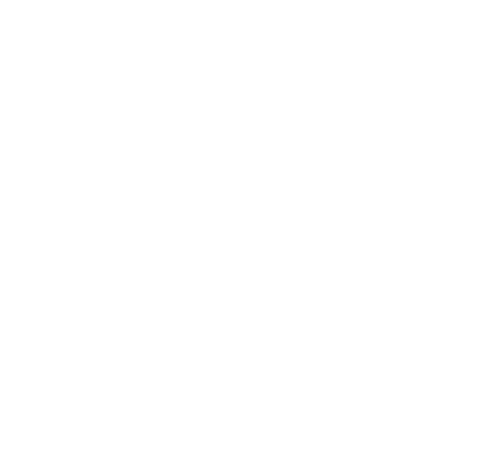
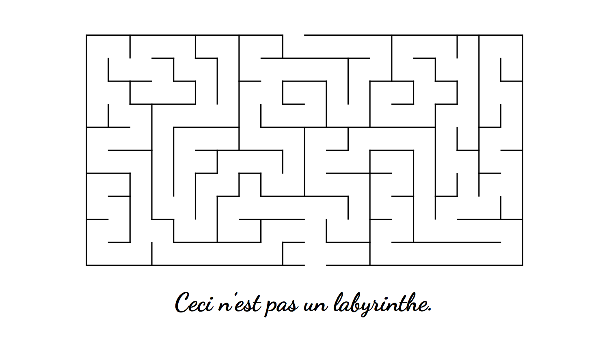
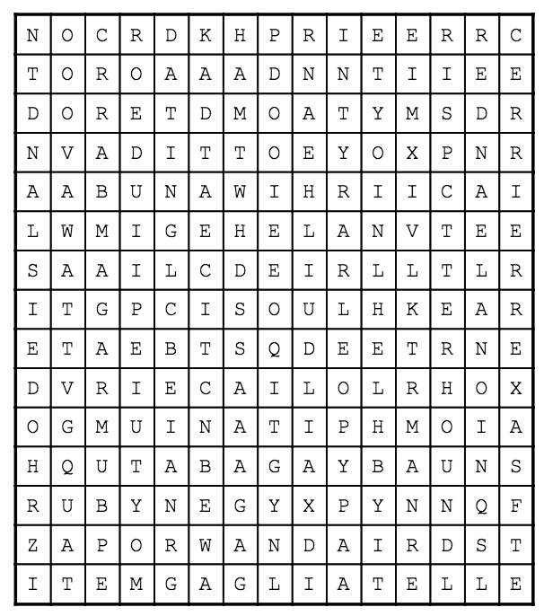
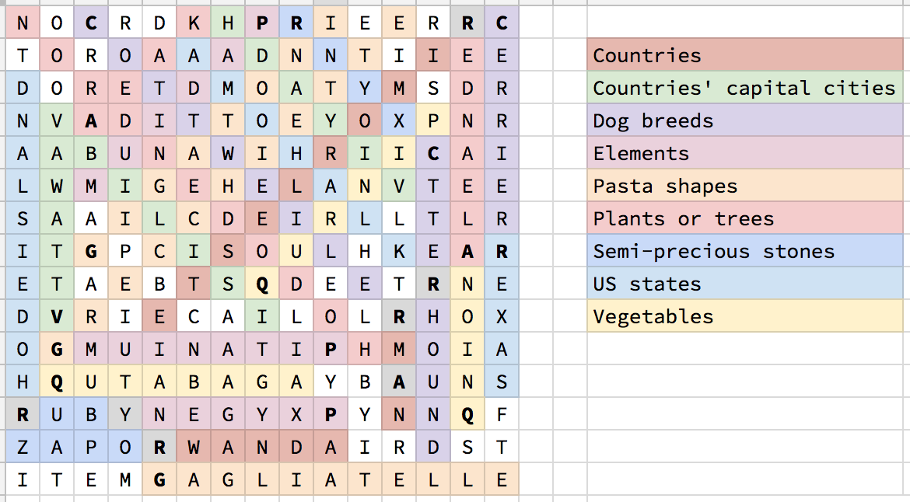

# DEF CON 25 Crypto and Privacy Village Contest Write-up
{:.no_toc}

Won by team rot(rot(λ)):
[CryptoK](https://twitter.com/0xF0unD)
[elegin](https://twitter.com/aaronsteimle)
[Jabroni](https://twitter.com)
[llamaprincess](https://twitter.com/_llamaprincess)
[pseudoku](https://twitter.com/_pseudoku)
[zevlag](https://twitter.com/zevlag)

Written by pseudoku

[Original Contest Website](http://goldbug.cryptovillage.org/tgbr/)
0. TOC
{:toc}

## iOS
###### tl;dr simple substitution cipher; different alphabet per line; concatenating all six ☆; flag=**SQUIDS**
{:.no_toc}

### Puzzle
{:.no_toc}

1. JK EJRN☆U. I☆T G☆ NRFJNUC QJ QTLU NUEJNC UVUNY QNTI☆TQDTIQGE QUDULSJIU EJIVUN☆TQGJI. FTYHU QSUY'C NUEJNCUC QSG☆ ☆U☆☆GJI.
2. WO HJIBSJP HNIY MPO☆TOIUBOQ. WO GBQSOI NGWNYQ. UNHO N VJBUO, JTS JM SCO ENEOG JM SJIATOQ, QKONFBIA SJ TQ. BS KGNYOR TQ N HBACSY RTE.
3. IUIMYFCI WTP PIEMIQP. DQ'P ASPQ T BTQQIM FR RDCGDCL F☆Q VWTQ QWIY TMI.
4. SHB ☆GMKPSLJS SH☆JO LIKUS QBTUP☆SY QYQSBGQ ☆QJ'S HKW SHBY WKPD, ☆S'Q HKW SHBY RL☆F.
5. MGV DGFN ☆G XGS VCFQ QMTLT ETLLCNTL QG KTECIF LTYKTQ? ... I VCFQ QMTE QG KTECIF LTYKTQ OGK CL DGFN CL ETF CKT YCHCRDT GO TUID.
6. OH XDQ VNCP PD RGGJ N ☆GELGP, XDQ BQ☆P NA☆D FOTG OP HLDB XDQL☆GAH.

### Solution
{:.no_toc}

This puzzle was a simple substitution cipher with a twist.
1. A ☆ is used in place of one of the characters.
2. Each line has a different substitution alphabet.

Solving the substitution yields
1. OF COURsE. NsA Is RUMORED TO TAPE RECORD EVERY TRANsATLANTIC TELEPHONE CONVERsATION. MAYBE THEY'D RECORDED THIs sEssION.
2. WE MONITOR MANY FREqUENCIES. WE LISTEN ALWAYS. CAME A VOICE, OUT OF THE BABEL OF TONGUES, SPEAKING TO US. IT PLAYED US A MIGHTY DUB.
3. EVERYONE HAS SECRETS. IT'S JuST A MATTER OF FINDING OuT WHAT THEY ARE.
4. THE iMPORTANT THiNG ABOUT SECURiTY SYSTEMS iSN'T HOW THEY WORK, iT'S HOW THEY FAiL.
5. HOW LONG dO YOU WANT THESE MESSAGES TO REMAIN SECRET? ... I WANT THEM TO REMAIN SECRET FOR AS LONG AS MEN ARE CAPABLE OF EVIL.
6. IF YOU WANT TO KEEP A sECRET, YOU MUsT ALsO HIDE IT FROM YOURsELF.

Put the lowercase characters (representing the ☆ characters) together yields the flag **SQUIDS**

## ColecoVision
###### tl;dr ITA2 code; flag=**LADYBUG**
{:.no_toc}

### Puzzle
{:.no_toc}

||  ||

### Solution
{:.no_toc}

This puzzle was a "straight forward" usage of [ITA2 (Baudot) code](https://en.wikipedia.org/wiki/Baudot_code#ITA2) in the 543.21 format. I quoted "straight forward" because it took us a couple of iterations; we were using ITA1, which is the original, obsolete version of the Baudot code.

Decoding the image yields the flag **LADYBUG**

## ZXSpectrum
###### tl;dr hidden characters; maze path yields base64 string; leftover characters provide clue to AES encryption key; flag=**WRIGGLER**
{:.no_toc}

### Puzzle
{:.no_toc}

||  ||

### Solution
{:.no_toc}

Ooo ooo a maze! Finally something I can solve without too much thinking. As I was happily solving the maze (which took literally 5 seconds), Jabroni tells me the French at the bottom says "This is not a maze." So much for that....

Upon further exploration, Jabroni notice the maze has hidden characters and a link to [http://aesencryption.net/](http://aesencryption.net/). This can be found by performing a `Select All` on the maze PDF (you did notice it was a PDF right?) and dumping the text to a text editor.

I immediately start reconstructing the string by selecting the characters in the order of the path out of the maze, starting from the bottom. This yields a base64 string:

`hX7Bptv6cM3X6A768KfTuQ==`

Converting this to ASCII yields nothing legible (the result is not even ASCII).

Hmmm... there is the rest of the characters that are not part of the maze path; I wonder if they provide a clue (never ignore unused data). Constructing a second string from the non-maze path yields the string:

`TREACHERY OF IMAGES PAINTERS LAST NAME ALL CAPS`

Aha! A quick Google search of the painting "Treachery of Images" reveals the artist René Magritte.

Remember the website [http://aesencryption.net/](http://aesencryption.net/) we came across? Perhaps putting `hX7Bptv6cM3X6A768KfTuQ==` as the encrypted text and `MAGRITTE` and pressing `Decrypt` may yield something...

**WRIGGLER**

Bingo!

## Atari 2600
###### tl;dr word search; words in each category have their first letter replaced; remaining letters form a clue; perform ROT13; flag=**CENTIPEDE**
{:.no_toc}

### Puzzle
{:.no_toc}

||  | Find 3 of each:   - Countries   - Countries’ capital cities   - Dog breeds   - Elements   - Pasta shapes   - Plants or trees   - Semi-precious stones   - US states   - Vegetables ||

### Solution
{:.no_toc}

Ehh... word search, not my favorite type of thing. Always feels like busy work.

We quickly realized this was not an ordinary word search because every word we found seemed to be one letter off (first letter to be exact). Here are the words we found:

||  ||

|| Categories                | Word Found   | Correct Spelling ||
||---------------------------|--------------|------------------||
|| Countries                 | RWANDA       | RWANDA           ||
||                           | RMAN         | OMAN             ||
||                           | RIMOR LESTE  | TIMOR LESTE      ||
|| Countries' capital cities | VIYADH       | RIYADH           ||
||                           | VTTAWA       | OTTAWA           ||
||                           | VBILISI      | TBILISI          ||
|| Dog breeds                | COTTWEILER   | ROTTWEILER       ||
||                           | CTTERHOUND   | OTTERHOUND       ||
||                           | CERRIER      | TERRIER          ||
|| Elements                  | PADIUM       | RADIUM           ||
||                           | PXYGEN       | OXYGEN           ||
||                           | PITANIUM     | TITANIUM         ||
|| Pasta shapes              | GIGATONI     | RIGATONI         ||
||                           | GRECCHIETTE  | ORECCHIETTE      ||
||                           | GAGLIATELLE  | TAGLIATELLE      ||
|| Plants or trees           | AHODODENDRON | RHODODENDRON     ||
||                           | ALEANDER     | OLEANDER         ||
||                           | AEAK         | TEAK             ||
|| Semi-precious stones      | RUBY         | RUBY             ||
||                           | RNYX         | ONYX             ||
||                           | ROPAZ        | TOPAZ            ||
|| US states                 | RHODE ISLAND | RHODE ISLAND     ||
||                           | RKLAHOMA     | OKLAHOMA         ||
||                           | REXAS        | TEXAS            ||
|| Vegetables                | QUTABAGA     | RUTABAGA         ||
||                           | QNION        | ONION            ||
||                           | QURNIP       | TURNIP           ||

Hmmm now what? I did notice each category had items that start with R, O, and T. Maybe a clue...

Wait, the letters that are left in the puzzle seem to spell something:

`ORDER TRIOS ALPHABETICALLY BY FIRST ITEM`

If we assume the ordering is ROT, the first item of each category starts with R. We came up with the following order:

|| Categories                | Word Found   | Correct Spelling ||
||---------------------------|--------------|------------------||
|| Elements                  | PADIUM       | RADIUM           ||
|| US states                 | RHODE ISLAND | RHODE ISLAND     ||
|| Plants or trees           | AHODODENDRON | RHODODENDRON     ||
|| Pasta shapes              | GIGATONI     | RIGATONI         ||
|| Countries' capital cities | VIYADH       | RIYADH           ||
|| Dog breeds                | COTTWEILER   | ROTTWEILER       ||
|| Semi-precious stones      | RUBY         | RUBY             ||
|| Vegetables                | QUTABAGA     | RUTABAGA         ||
|| Countries                 | RWANDA       | RWANDA           ||

In this order, the replacement letter of each category gives us:

`PRAVGCRQR`

Not much of anything. Wait... the ROT clue!

`rot13(PRAVGCRQR)` = **CENTIPEDE**

## Nintendo 64
###### tl;dr camera overlay; split overlay into two separate parts, top and bottom; align green square with red squares at multiple locations; yields arrows and letters; flag=**BUCKBUMBLE**
{:.no_toc}

### Puzzle
{:.no_toc}

### Solution
{:.no_toc}

## Apple II
###### tl;dr each line spells out a casino in Las Vegas; reorder lines until middle highlighted letters spell BACON CIPHER; in the front highlighted letters, lowercase is A and uppercase is B; flag=**DUNGBEETLES**
{:.no_toc}

### Puzzle
{:.no_toc}

### Solution
{:.no_toc}

## Game Boy
###### tl;dr concatenate hex numbers from all five keys using the Roman numeral ordering on back; XOR the result with the hex numbers on lanyard; flag=**YARS'REVENGE**
{:.no_toc}

### Puzzle
{:.no_toc}

### Solution
{:.no_toc}

## Playstation 2
###### tl;dr flag=**EXTERMINATION**
{:.no_toc}

### Puzzle
{:.no_toc}

### Solution
{:.no_toc}

## META puzzle
###### tl;dr flag=**QUINCUNX**
{:.no_toc}

### Puzzle
{:.no_toc}

### Solution
{:.no_toc}
Solutions:
SQUIDS
LADYBUG
WRIGGLER
CENTIPEDE
BUCKBUMBLE
DUNGBEETLES
YARS’REVENGE
EXTERMINATION

Key: 2 6 3 3 3 2 10 2 < Check this > checked

Meta-Solution: QUINCUNX
